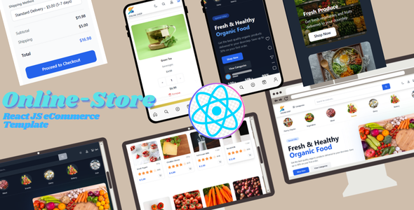

# Online Shop - Modern E-commerce Template

A modern, feature-rich e-commerce template built with React and Tailwind CSS, featuring a beautiful dark mode, responsive design, and comprehensive shopping features.



## 🌟 Key Features

- 🎨 Modern, Clean Design with Dark/Light Mode
- 📱 Fully Responsive Layout (Mobile, Tablet, Desktop)
- 🛍️ Complete E-commerce Functionality
  - Product Categories & Filtering
  - Shopping Cart Management
  - Multiple Payment Options
  - Order Summary
- 🔍 Advanced Search with Real-time Results
- 🎯 Product Categories
  - Cooking Essentials
  - Fresh Produce
  - Dairy & Eggs
  - Beverages
  - Snacks & Confectionery
  - And More!
- 💫 Smooth Animations & Transitions
- 🔒 Secure Checkout Process
- 📱 Mobile-First Approach

## 🚀 Quick Start

### Prerequisites

- Node.js 16.x or later
- npm or yarn
- Git

### Installation

1. Clone the repository:
```bash
git clone [https://github.com/sayedsafi2000/online-store-react-template.git]
cd online-store-react-template
```

2. Install dependencies:
```bash
npm install
```

3. Start the development server:
```bash
npm run dev
```

4. Build for production:
```bash
npm run build
```

5. Preview production build:
```bash
npm run preview
```

The application will be available at `http://localhost:5173` in development mode.

## 🛠️ Built With

- **React 18** - Frontend library
- **Tailwind CSS** - Styling
- **React Router v6** - Routing
- **React Icons** - Icons
- **Context API** - State management

## 📁 Project Structure

```
src/
├── assets/          # Static assets and images
├── components/      # Reusable UI components
│   ├── ProductCard/
│   └── ...
├── Pages/          # Page components
│   ├── Home/
│   ├── Cart/
│   ├── Checkout/
│   └── ...
├── Provider/       # Context providers
│   ├── AuthProvider
│   └── ThemeProvider
├── Router/        # Route configurations
└── Shared/        # Shared components
    ├── Header/
    └── Footer/
```

## 🎨 Customization

### Theme Customization

1. Colors and theme settings can be modified in `tailwind.config.js`:
```javascript
module.exports = {
  theme: {
    extend: {
      colors: {
        // Your custom colors
      }
    }
  }
}
```

2. Dark mode settings can be adjusted in the ThemeProvider.

### Product Data

Product data is stored in `public/products.json`. You can modify this file to:
- Add new products
- Update prices
- Modify categories
- Change product images

## 📱 Responsive Breakpoints

- Mobile: 320px - 639px
- Tablet: 640px - 1023px
- Desktop: 1024px and above

## 🌐 Browser Support

- Chrome (latest)
- Firefox (latest)
- Safari (latest)
- Edge (latest)
- Opera (latest)

## 📄 License

This template is available under two licenses:

1. Regular License
   - Single end product
   - Free or commercial use
   - Support for 6 months

2. Extended License
   - Multiple end products
   - Free or commercial use
   - Support for 12 months

## 🤝 Support

For support, please contact:
- Email: support@onlineshop.com
- Documentation: [Link to documentation]
- Issues: GitHub Issues section

## 🙏 Credits

- Product Images: [Unsplash](https://unsplash.com)
- Icons: [React Icons](https://react-icons.github.io/react-icons)
- Fonts: Inter, Manrope (Google Fonts)

---

Made with ❤️ by Online Shop Team

## Pages Included

1. Home Page
2. Product Listing
3. Product Details
4. Shopping Cart
5. Checkout
6. Search Results
7. Category Pages
8. User Authentication (Login/Signup)
9. About Us
10. Contact Us
11. FAQ
12. Shipping Information
13. Returns Policy
14. Terms & Conditions
15. Privacy Policy

## Tech Stack

- React.js
- Tailwind CSS
- React Router DOM
- React Icons
- Context API for State Management

## Getting Started

1. Clone the repository:
```bash
git clone [https://github.com/sayedsafi2000/online-store-react-template.git]
```

2. Install dependencies:
```bash
npm install
```

3. Run the development server:
```bash
npm run dev
```

## Project Structure

```
src/
├── assets/         # Static assets
├── components/     # Reusable components
├── Pages/         # Page components
├── Provider/      # Context providers
├── Router/        # Route configurations
└── Shared/        # Shared components (Header, Footer)
```

## Customization

### Colors
The template uses Tailwind CSS for styling. You can customize colors in the `tailwind.config.js` file.

### Typography
Font families and sizes can be modified in the Tailwind configuration and CSS files.

### Components
All components are modular and can be easily customized or extended.

## Browser Support

- Chrome (latest)
- Firefox (latest)
- Safari (latest)
- Edge (latest)
- Opera (latest)

## Support

For support, please email safiuddin102030@gmail.com

## License

MIT License

Copyright (c) 2024 Online Shop

Permission is hereby granted, free of charge, to any person obtaining a copy
of this software and associated documentation files (the "Software"), to deal
in the Software without restriction, including without limitation the rights
to use, copy, modify, merge, publish, distribute, sublicense, and/or sell
copies of the Software, and to permit persons to whom the Software is
furnished to do so, subject to the following conditions:

The above copyright notice and this permission notice shall be included in all
copies or substantial portions of the Software.

THE SOFTWARE IS PROVIDED "AS IS", WITHOUT WARRANTY OF ANY KIND, EXPRESS OR
IMPLIED, INCLUDING BUT NOT LIMITED TO THE WARRANTIES OF MERCHANTABILITY,
FITNESS FOR A PARTICULAR PURPOSE AND NONINFRINGEMENT. IN NO EVENT SHALL THE
AUTHORS OR COPYRIGHT HOLDERS BE LIABLE FOR ANY CLAIM, DAMAGES OR OTHER
LIABILITY, WHETHER IN AN ACTION OF CONTRACT, TORT OR OTHERWISE, ARISING FROM,
OUT OF OR IN CONNECTION WITH THE SOFTWARE OR THE USE OR OTHER DEALINGS IN THE
SOFTWARE.

### Commercial License Notes

When purchasing through ThemeForest:
- Regular License: Use in a single end product (either free or paid)
- Extended License: Use in unlimited end products
- Includes 6 months of support with option to extend
- Free lifetime updates
- Full source code access

## Credits

- Images: Unsplash,
- Icons: React Icons
- UI Components: Custom-built with Tailwind CSS

ThemeForest-Package/
├── Main-Files/               # Your source code
│   ├── src/                  # React source files
│   ├── public/              # Public assets
│   ├── package.json         # Dependencies
│   ├── README.md            # Installation instructions
│   └── LICENSE.md           # MIT License
│
├── Documentation/           # All documentation files
│   ├── documentation.md     # Main documentation
│   ├── changelog.md         # Version history
│   └── credits.md          # Credits for images/resources
│
└── Preview-Files/          # All preview materials
    ├── screenshots/        # Application screenshots
    │   ├── main-preview.jpg    # 590×300 main image
    │   ├── features/           # Feature screenshots
    │   ├── responsive/         # Mobile/tablet views
    │   └── dark-mode/         # Dark mode screenshots
    │
    └── promotional/        # Marketing materials
        ├── thumbnail.jpg       # 80×80 thumbnail
        └── banner.jpg          # 600×300 banner